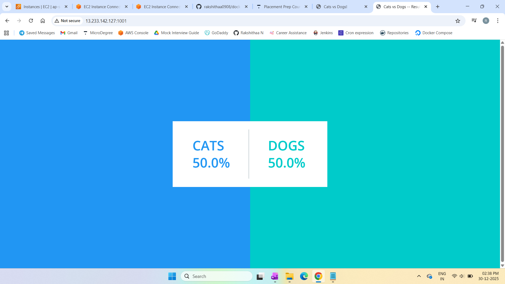

# Dockerized Web App

This project demonstrates how to deploy a multi-container web application using Docker and Docker Compose. The setup includes frontend services, background workers, in-memory caching, and a database, all running as isolated containers and connected through Docker networking. The guide includes concepts, architecture, deployment steps, and screenshots.

---

## Concepts

### Docker
A containerization platform that packages applications and their dependencies into lightweight, portable containers.

###Docker Compose
A tool used to define and manage multi-container Docker applications using a YAML configuration file.

### Key Features
- Multi-container application deployment
- Service-to-service communication using Docker networking
- Isolated environments for each service
- Easy startup and teardown using Docker Compose
- Scalable setup

### Limitations
- Requires Docker and Docker Compose to be installed
- Containers stop when the host instance is stopped

---

## Deployment Steps

Full deployment instructions:  
See full deployment instructions [here](docs/deployment-steps.md)

---

## Project Structure
```
dockerized-web-app/
│
├── docs/
│ ├── deployment-steps.md 
│ └── screenshots/
│ 	├── vote.png 
│ 	├── result.png 
│ 	└── architecture.png # Architecture diagram
├── README.md 
└── LICENSE 
```

---

## Architecture Diagram

**Dockerized web app – Voting  Web Application Architecture**  


---

## Screenshots

**Voting Application(Frontend)**  


**Result (Live Results)**  


---

## License

MIT License. See `LICENSE` file for details.

