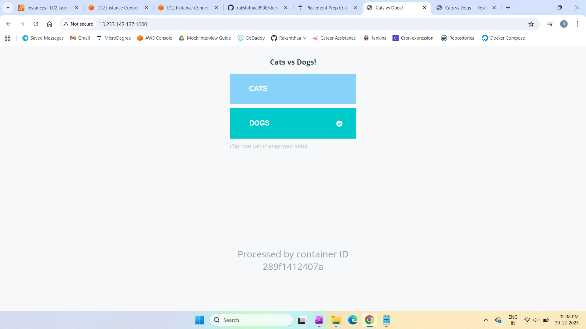
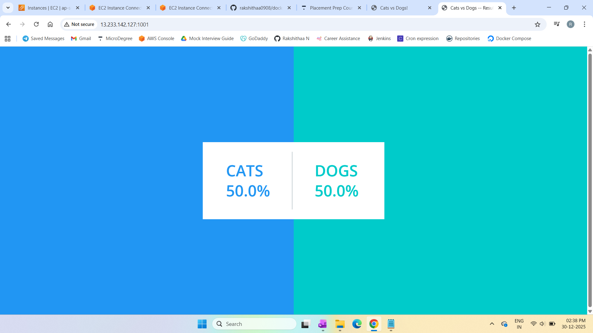

# Dockerized Voting Web Application

This project demonstrates a multi-container voting web application built with Docker and Docker Compose. The app includes a frontend, backend, background workers, in-memory caching, and a database, all running in isolated containers connected through Docker networking.

---

## Concepts

- **Docker**: A containerization platform that packages applications and their dependencies into lightweight, portable containers. 
- **Docker Compose**: A tool to define and manage multi-container Docker applications using a YAML file. 

### Features
- Multi-container application deployment
- Service-to-service communication using Docker networking
- Isolated environments for each service
- Easy startup and teardown using Docker Compose
- Scalable setup

### Limitations
- Requires Docker and Docker Compose to be installed
- Containers stop when the host instance is stopped

---

## Deployment Steps

For detailed deployment instructions, see [docs/deployment-steps.md]

---

## Project Structure
```
dockerized-web-app/
│
├── docs/
│ ├── deployment-steps.md # Detailed deployment instructions
│ └── screenshots/
│ 	├── vote.png 
│ 	├── result.png 
│ 	└── architecture.png # Architecture diagram
├── result/ # Result service
│ └── static/
│   ├── style.css
│ ├── Dockerfile
│ ├── app.js # Frontend JavaScript
│ ├── index.html
│ ├── package-lock.json
│ ├── package.json
│ ├── server.js # Backend server
│ ├── socket.io.js
├── vote/ # Voting service
│ └── static/
│   ├── style.css
│ ├── Dockerfile
│ ├── app.py
│ ├── requirements.txt
├── worker/  # Background worker
│ ├── Dockerfile
│ ├── Program.cs
│ ├── worker.csproj
├── README.md
├── docker-compose.yaml
└── LICENSE 
```

---

## Architecture Diagram

**Dockerized web app – Voting  Web Application Architecture**  


---

## Screenshots

**Voting Application(Frontend)**  


**Result (Live Results)**  


---

## License

MIT License. See `LICENSE` file for details.

